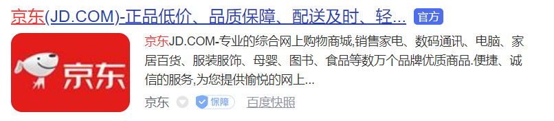
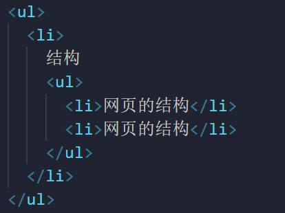
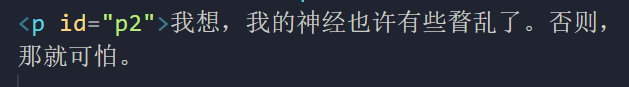
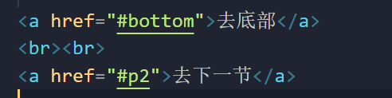

# （1）meta标签

1.用w3school（中文文档）文档查

2.英文文档：MDN（较权威）

​	metadata元数据，meta主要用于设置网页中的一些元数据，元数据不是给用户看的（给浏览器）

​	常用属性：

​		charset  指定网页的字符集

​		name  指定数据的名称

​		content  指定数据的内容


​		***keywords***表示关键字（搜哪些关键字，该网站会出来），可以同时指定多个关键字，使用 , 隔开

​		忘记如何使用时，浏览器打开京东查看源码，直接模仿


​		

​		***discription***用于指定网站的描述（网站的介绍），显示在搜索引擎的搜索结果中

​		title标签的内容会作为搜索结果的超链接上的额文字显示：




​		***http-equiv***（设置http协议）重定向到另一个网站：


content前均为固定，3表示3s后跳转


# （2）语义化标签

在网页中HTML专门用来负责网页的结构，所以在使用html标签时，应该关注的是标签的语义，而不是它的样式

## （2.1）标题标签

​	h1-h6  一共有六级标签，重要性递减，h1最重要

​	h1在网页中的重要性仅次于title标签，一般情况下一个页面只会有一个h1，一般情况下标题标签只会使用到h1-h3

**h${标题}*6**     回车


注：在页面中独占一行的元素称为块级元素（block element），h1-h6均为块元素

***hgroup***（为块级元素）：


## （2.2）p标签

*p标签表示页面中的一个段落*

p标签也为块级元素

## （2.3）em标签


em显示为斜体

注：在页面内不会独占一行的元素称为行内元素（inline element）

em标签为行内元素

## （2.4）strong标签


strong为行内元素，显示为加粗

## （2.5）blockquote

blockquote（块级元素）表示一个长引用


q（行级元素）表示一个短引用


## （2.6）br标签

br标签表示换行

自结束标签


## （2.7）布局标签（结构化语义标签）

### （2.7.1）header标签

*header*表示网页的头部

### （2.7.2）main标签

*main表示网页的主体部分（一个网页中只有一个）*

### （2.7.3）footer标签

*footer表示网页的底部*


### （2.7.4）nav标签

*nav表示网页中的导航*

### （2.7.5）aside标签

*aside表示和主体相关的其他内容*（主要为侧边栏）


### （2.7.6）article标签

*article表示一个独立的文章*

*注：2.7.1-2.7.6的标签在显示效果上没有区别，注意其语义，在实际开发中会结合css表示样式*

### （2.7.7）section标签

section表示一个独立的区块，上边的标签都不能表示时使用section

*注：以上标签均为h5新增的，用的并不是很多*，其中1 4 7 相对多一点

### （2.7.8）div标签

div为块元素，没有语义，就用来表示一个区块，目前来讲div是我们主要的布局元素（div可以代替以上所有）

在实际开发中，块级元素一般就用div

### （2.7.9）span标签

span为行内元素，没有任何语义，一般用于在网页中选中文字

# 小结

## 块元素

​	在网页中一般通过块元素对页面进行布局

## 行内元素

​	行内元素主要用来包裹文字，设置效果


- 一般情况下会在块元素中放行内元素，而不会在行元素中放块元素

- 块元素中基本上什么都能放

- p元素中不能放任何元元素

  注意：浏览器在解析网页时，会自动对网页中不符合规范的内容进行修正

  比如：

  ​		标签写在了根元素<html>外部

  ​		p元素中嵌套了块元素

  ​		根元素中出现了除head和body以外的子元素

  ​		......

  

  右击网页->检查（或直接按键盘上F2）->打开开发者工具->点击elements  就可以看到修正后的代码（内存中的显示）

# （3）列表标签

## （3.1）无序列表

使用ul标签来创建有序列表，使用li表示列表项


一般用于导航菜单


## （3.2）有序列表

*有序列表：使用ol标签来创建有序列表，使用li表示列表项*


## （3.3）定义列表

*定义列表：使用dl标签来创建一个定义列表，使用dt来表示定义的内容，使用dd来对内容进行解释说明*


也可用于导航菜单

注：列表之间可以互相嵌套




# （4）超链接

可以让我们从一个页面跳转到其他页面，或者是当前页面的其他位置

使用a标签来定义超链接

a标签是行内元素，在a标签中可以嵌套任何元素（除了它自身）


属性：

- herf  指定跳转的目标路径

  ​         -值可以是一个外部网站的地址，也可以是一个内部页面的地址

  ​        

- 相对路径：


*../表示当前文件所在目录的上一级目录*


此时就可以正确访问


（path目录下有inner target2.html文件在inner目录下）

- target属性：用来指定超链接打开的位置

     *可选值：*

  ​    *_self默认值 在当前页面中打开超链接*

  ​    *_blank 在一个新的页面中打开超链接*

当网页篇幅过长时：

*可以直接将超链接的href属性设置为#，这样点击超链接以后，页面不会发生跳转，而是转到当前页面的顶部的位置*

```
<a href="#">回到顶部</a>
```

*可以跳转到页面的指定位置，只需将href属性设置为   #目标元素的id属性值*


注： *id属性（唯一不重复的）*

  *每一个标签都可以添加一个标签属性*

  *id属性就是元素的唯一标识，同一个页面中不能出现重复的id属性*

在标签中添加完id属性，可以去任意位置：






注：上面蓝色的超链接时javascript:;作为href属性的效果，点击无任何效果

# （5）图片标签

*图片标签用于向当前页面中引入一个外部图片*

  *使用**img**标签来引入外部图片，img标签是一个自结束标签*

   img元素属于替换元素（不独占一行，基于块和行内元素之间，具有两种元素的特点）

  *属性：*

- *src 属性指定的是外部图片的路径（路径规则同超链接）*

- *alt属性 是指对图片的描述，这个图片默认情况下不会显示，有的浏览器会在图片无法加载时显示*（搜索引擎会根据alt中的内容来识别图片）

- *width 图片的宽度（单位是像素）*

-  *height 图片的高度*

​     *宽度和高度中如果只修改了一个，则另一个会等比例缩放*

 	*注意：一般情况下在pc端，不建议修改图片的大小（大图缩小浪费内存，小图放大图片失真），最好需要多大的图片就裁多大；但是在移动端，经常需要对图片进行缩放（常用大图缩小）*

```
<!-- 引入内部文件夹图片 -->
   
   
<!-- 引入外部图片（网页直接搜索想要的图片然后右击选择复制图片地址） -->
   

```


图片的格式：

 	jpeg（jpg）

​			-支持的颜色比较丰富，不支持透明效果，不支持动图

​			-一般用来显示照片

 	gif

​			-支持的颜色比较少，支持简单透明，支持动图

​			-颜色一般的图片，动图

 	png

​			-支持的颜色丰富，支持复杂透明，不支持动图

​			-颜色丰富，复杂透明图片（专为网页而生）

 	webp

​			-这种格式是谷歌新推出的专门用于表示网页中的图片的一种格式

​			-它具备其他图片格式的所有优点，而且文件还人特别小

​			-缺点：兼容性不好

​	 base64（不是图片格式）

​			-将图片使用base64编码，这样可以将图片转化为字符，通过字符的形式来引入图片

​			-一般都是一些需要和网页一起加载的图片才会使用base64（一般浏览器向服务器发送第一次请求时加载网页本身，如果网页中还有其他外部文件如两个图片，还需再发送两次请求（因此图片会比网页本身稍微延迟一会出来））

​			-使用时直接搜索引擎base64找图片在线转换

图片选择：效果一样，用小的，效果不一样，用效果好的

# （6）内联框架

*内联框架：用于向当前页面中引入一个其他页面*

​    *src用于指定要引入的网页的路径*

​    *frameborder指定内联框架的边框（0无1有）*

注：一般情况使用不多，内联框架不会被搜索引擎所爬取

```
<iframe src="https://www.qq.com" width="800" height="600" frameborder="0"></iframe>
```


（在网页中引入了腾讯网的效果）


# （7）音视频

## （7.1）音频

*audio标签用来向页面中引入一个外部的音频文件*

​    *音视频文件引入时，默认情况下不允许用户自己控制播放停止*

  *属性：*

​    *controls是否允许用户控制播放*

​    *autoplay音频文件是否自动播放*

​     *-如果设置了autoplay则音乐在打开页面时会自动播放，但是目前大部分浏览器都不会自动对音乐进行播放*

​    *loop 音乐是都循环播放*

```
<audio src="./source/12820.mp3" controls  autoplay loop></audio>
```

另一种方式：


（ie8及以下不支持音视频播放）

```
<!-- 除了通过上面指定外部文件以外，还可以通过source来指定文件 -->
  <audio controls>
    对不起，您的浏览器不支持播放音频，请升级浏览器！
    <!-- 好处是当浏览器不支持音视频时识别不了标签但是不能忽略文字因此能显示提示 
    可以同时使用多个source浏览器支持哪个用哪个都不支持显示文字
    -->
    <source src="./source/12820.mp3">
    <source src="./source/12820 .ogg">
  </audio>
```

注：使用*embed标签可以兼容一些老版本的浏览器*


## （7.2）视频


实际开发中，音视频不会直接放到服务器中，而是会买第三方的产品

不用花钱的方式：把自己的视频音频传到视频网站中，然后将视频音频网站引进自己的网页中

例如直接将腾讯视频的某视频引入自己的网页中

方式：搜索腾讯视频打开要用的视频->点击分享->嵌入代码->将所复制的代码直接粘贴


效果：

